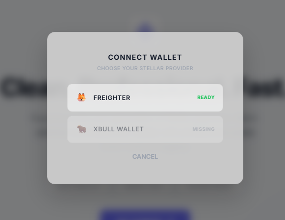

# Stellar Connect Wallet DApp

A professional, seamless Stellar decentralized application allowing users to connect their Stellar wallets, check balances, and interact with smart contracts on the Stellar Testnet.

## Key Features

*   **Wallet Integration**: Connect seamlessly using Freighter or xBull wallets.
*   **Real-time Balances**: Fetch and display native XLM balances instantly.
*   **Smart Contract Interaction**: Record and track payments on a deployed Soroban smart contract.
*   **Optimized Performance**: Built with React 19 and optimized for fast processing.

## Requirements

*   Node.js (v18 or higher recommended)
*   npm or yarn
*   A Stellar Wallet extension installed in your browser (Freighter or xBull)

## Local Host Setup Instructions

1.  **Navigate to the project directory** (if you haven't already):
    ```bash
    cd stellar-connect-wallet
    ```

2.  **Install dependencies**:
    ```bash
    npm install
    ```

3.  **Start the development server**:
    ```bash
    npm start
    ```
    The application will automatically open in your default browser at `http://localhost:3000/`.

4.  **Connecting your wallet**:
    *   Ensure your browser wallet (e.g., Freighter) is configured to the **Testnet**.
    *   Click "Connect Wallet" in the application and authorize the connection.

## Build for Production

To create an optimized production build:

```bash
npm run build
```

## Contract Details

*   **Network**: Stellar Testnet
*   **Deployed Contract Address**: `CDLZFC3SYJYDZT7K67VZ75HPJVIEUVNIXF47ZG2FB2RMQQVU2OOTH67I`
*   **Sample Transaction Hash**: `ba51bbdb7c7bcd27a94657cbc8c90e1db4c62041f1dcec15184bc550ecb03ff2`

## Wallet Options

Below are the available wallet options for connection:



## Live Demo

*   **Live Application**: [https://stellardapp.vercel.app/](https://stellardapp.vercel.app/)
